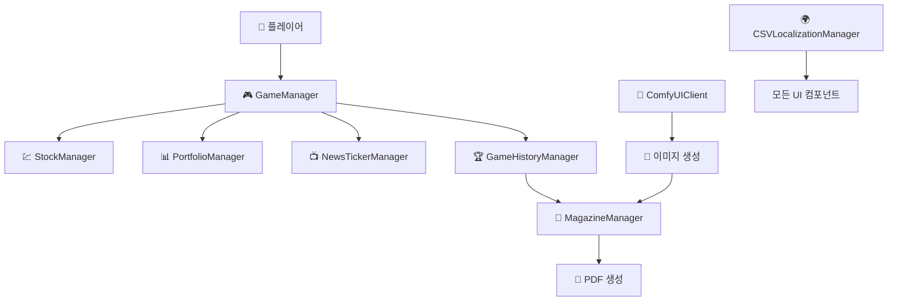

# 🧠 AI 투자 시뮬레이터 | AI Investment Simulator

> "당신의 투자 스타일은 워런 버핏? 레이 달리오? AI가 분석해드립니다."

AI 투자 시뮬레이터는 단순한 게임을 넘어 **교육**, **AI 기술**, 그리고 **실시간 인터랙션**을 결합한 **차세대 체험형 콘텐츠**입니다.  
플레이어는 100만 원의 가상 자산으로 10턴 동안 투자를 진행하고, 최종적으로 **자신만의 투자 스타일 분석 리포트**를 **실물 A4 신문 형태**로 받아볼 수 있습니다.

---

## 🎯 핵심 컨셉

- 💰 **10턴 투자 체험**: 100만 원으로 전략적 투자 실행  
- 🎨 **ComfyUI 연동**: 개인화 라이프스타일 이미지 생성  
- 📰 **실물 신문 제공**: A4 출력 가능한 투자 리포트  
- 🏆 **유명 투자자 매칭**: AI 기반 스타일 분석  
- 🌍 **완전한 다국어 지원**: 한국어/영어 런타임 변환  

---

## 📋 주요 기능

### 🎮 게임플레이 흐름
```text
초기 자금 설정 → 10턴 투자 진행 → 이벤트 반응 → 결과 분석 → AI 이미지 생성 → 신문 출력
```

### 💼 투자 시스템
- 15개 가상 종목 (기술, 반도체, 전기차, 가상자산, 대기업)
- 실시간 시세 변동 + 정책/이슈 이벤트 반영
- 현실감 있는 수수료 시스템 (0.25%)
- 섹터 분산투자 보너스 (★ 진행도 별표 시스템)

### 📺 실감형 뉴스
- 실시간 뉴스 티커 & 속보 알림
- 턴별 정책 이벤트: AI 기술, 에너지, 금리, 규제 변화 등

### 🤖 AI 개인화 분석
- 투자 스타일 분석: 워런 버핏, 조지 소로스, 레이 달리오 등
- AI 이미지 생성: ComfyUI + LoRA로 라이프스타일 이미지 출력
- 거래 성향, 수익률, 분산도 기반 포트폴리오 분석

### 📰 매거진 리포트
- 실시간 자동 신문 레이아웃 구성
- A4 사이즈 PDF 생성 및 자동 저장
- 사용자별 맞춤 조언과 시각 자료 포함

---

## 🛠️ 기술 스택

| 항목 | 내용 |
|------|------|
| 🎮 **게임 엔진** | Unity 6 (2024 LTS), C# 12.0 |
| 💻 **플랫폼** | Windows Kiosk |
| 🤖 **AI 이미지** | ComfyUI + SDXL + Custom LoRA |
| 🖼️ **해상도** | 1024×1024 (Lifestyle), 512×512 (Icons) |
| 📡 **API 통신** | RESTful API (Port 8188) |
| 🌍 **다국어 지원** | CSV 기반, 실시간 전환, 폰트 최적화 |
| 📰 **PDF 생성** | Custom A4 Magazine Layout + Print API |

---

## 🧩 시스템 아키텍처



---

## 🏆 투자자 스타일 매칭

| 스타일 유형 | 분석 기준 | 매칭 인물 |
|-------------|-----------|-----------|
| 집중투자형 | 거래 ≤8회, 섹터 ≤2, 수익률 ≥40% | 워런 버핏 |
| 액티브형 | 거래 ≥25회, 수익률 ≥35% | 조지 소로스 |
| 신중투자형 | 거래 ≤10회, 섹터 5개 분산 | 벤저민 그레이엄 |
| 균형투자형 | 4섹터 분산, 수익률 25~45% | 레이 달리오 |
| 성장투자형 | 수익률 ≥50%, 중간 거래량 | 피터 린치 |
| 안정투자형 | 분산투자, 꾸준한 수익 | 존 보글 |

---

## 🖼️ AI 이미지 예시 프롬프트 (ComfyUI)

| 등급 | 프롬프트 |
|------|----------|
| **Upper** | `luxury penthouse interior, premium furniture, city skyline view` |
| **MiddleUpper** | `modern apartment interior, comfortable living space` |
| **Middle** | `cozy home interior, simple modern furniture` |
| **Lower** | `modest room interior, basic furniture, minimalist` |

---

## 🧩 게임 흐름 요약

1️⃣ **게임 시작**
- 100만원 자금 / 10턴 제한 / 30초 턴 타이머  
2️⃣ **전략 수립**
- 종목 선택, 분산투자 보너스 활용  
3️⃣ **이벤트 대응**
- AI·금리·에너지·가상자산 이슈 대응  
4️⃣ **결과 분석**
- 투자 스타일 자동 분석, AI 이미지 생성  
5️⃣ **실물 출력**
- A4 신문 PDF 자동 출력, 영구 보관용  

---

## 📌 설치 및 실행

```bash
1. Unity 2024 LTS 설치
2. ComfyUI 로컬 서버 실행 (Port 8188)
3. 프로젝트 열기 및 실행
```

---

## 🔗 기타 링크

- 📸 [샘플 매거진 보기](#)  
- 🧠 [ComfyUI 워크플로우](#)  
- 🧾 [AI 투자자 매칭 공식 문서](#)  
- 🌍 [로컬라이징 구조 설명](#)

---

## 🧭 기여 및 피드백

이 프로젝트는 지속적인 개선을 지향합니다.  
버그 제보, 제안, 협업 요청은 언제든 환영입니다.

---

> **Made with Unity + AI + 금융교육 열정**
